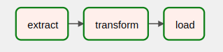

# ETL Pipeline with PySpark and Apache Airflow

---

`Demo for CreditBook`

## Installation and Run

---

#### Local

- The project was locally tested with `python-3.9.12` and `python-3.7.12`
- Create a new virtual environment `python -m venv venv`
- Activate the environment `source venv/bin/activate`
- Install dependencies `pip install -r requirements-dev.txt`
- `csv` files should be placed inside the datasets directory
- Set the following ENVIRONMENT VARIABLES
  - `export AIRFLOW__CORE__DAGS_FOLDER=$PWD/ AIRFLOW_HOME=$PWD/airflow AIRFLOW__CORE__LOAD_EXAMPLES=false`
- Airflow commands for initiating local db and creating user
  - `airflow db init`
  - -
  -
  ```bash
  airflow users create \
  --username airflow \
  --firstname Peter \
  --lastname Parker \
  --role Admin \
  --email spiderman@superhero.org
  ```
  - Set a password
- Run the following commands in separate shell instances
  - `airflow scheduler`
  - `airflow webserver`
- Now visit http://localhost:8080 and login
- You might need to change the DB_HOST to set the appropriate DB

#### With docker

- docker-compose -f docker-compose-airflow.yaml up

## Overview

---

ETL according to Wikipedia

- In computing, extract, transform, the load is a three-phase process where data is first extracted then transformed, and finally loaded into an output data container.



For solving this particular problem, it seemed reasonable to use the following tools

- Apache Pyspark --> Analytics Engine
- Apache Airflow --> Workflow Management Tool

#### Extract

Table `Users` and `Transactions` both had a field called `data` where JSON formatted data were stored. My first step was to unnest those fields and make necessary columns out of them. To unnest the I wrote a custom JSON parser, and also some `schemas` to extract necessary fields according to appropriate data types.

#### Transform

The transformation stage was more challenging as this part contained resource-heavy computations. To overcome the issue, transformations were designed column-focused. That means in most of the steps I only dealt with a single column.

Caching the columns improved performance as the later part of the transformation where grew rapidly with new columns.

Airflow isolates each task in the dags. So, data frame objects from one stage to another were not naturally transferable. To handle this issue, data frames were transferred as parquet files among the stages.

Disclaimer: Calculated fields were most probably expected to be nested fields. The Postgres driver raises some issues with nested fields, so due to time constraints, the fields are flattened as columns. Also, the field values may deviate from the expected values as no detailed instructions were provided for these fields.

#### Load

As no data warehouse service was provided, I chose to use Postgres as a local data warehouse. Postgres driver for Spark was used to transfer processed data faster to the database. Spark session, dataset artifacts, garbage variable, etc. are torn down in this step.

The exported table can be accessed from [Postgres Admin Portal](http://localhost:5050). Credentials are stored in the `.env` file. (user: airflow, pass: airflow)

## Future Steps

Although a working ETL pipeline has been established, it is still not production-ready and can be improved in various ways. Some of the points are discussed below-

- A more optimized dag flow could be written
- The airflow docker image is not optimized for performance. A more lightweight image could be built from smaller base images with all the requirements installed inside.
- Currently, the ETL file contains all the concrete implementations of Extract, Transform, and Load. Distributing these elements across multiple files will surely improve the readability of code and align better with the Single Responsibility Principle.
- Better test coverage could be included to make the pipeline more reliable.
- All the computations are now done on a single machine. It limits the performance of the analytics engine. Distributed computations and dedicated analytics databases could be integrated to offload expensive computations to remote servers.
- Rigorous data validation pipeline could be introduced to avoid unexpected scenarios in production.
